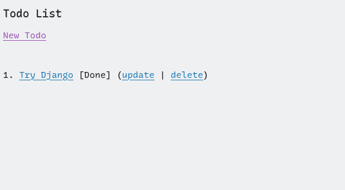

# Todo Application

This is a simple CRUD application built with the Django framework to manage todo items.

## Screenshot


## Features

- **Create**: Users can add new todo items.
- **Read**: List all existing todo items and retreive their details.
- **Update**: Users can edit existing todo items.
- **Delete**: Users can remove todo items that are no longer needed.

## Tech Stack

- **Django**: Web framework for rapid application development.
- **SQLite**: Default database used to store todo item data.

## Getting Started

1. Clone this repository.
2. Install dependencies.
3. Run database migrations:
   ```bash
   python3 manage.py makemigrations
   python3 manage.py migrate
   ```
4. Start Server:
   ```bash
   python3 manage.py runserver
   ```
5. Visit "http://127.0.0.1:8000/todo/"
   
   
